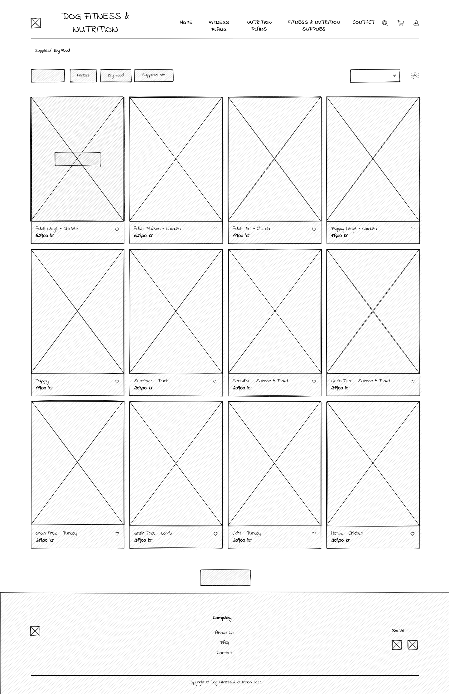
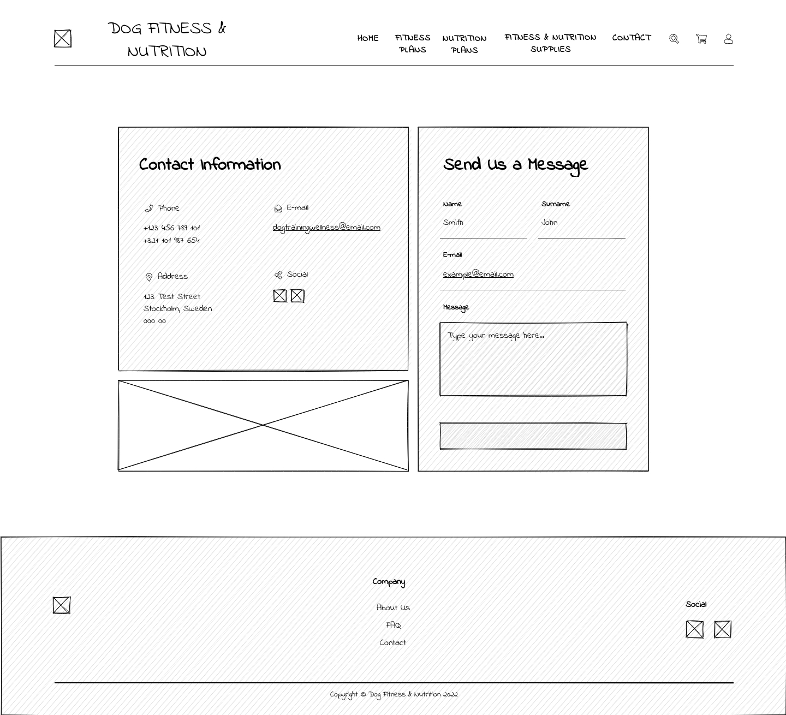

# Dog Fitness & Training

## Table of Contents

* [Description](#description)
* [User Stories](#user-stories)
* [Wireframe](#wireframe)
    * [Homepage](#homepage)
    * [Training Plan](#training-plan)
    * [Nutrition Plan](#nutrition-plan)
    * [Product Page](#product-page)
    * [Product Detail](#product-detail)
    * [Shopping Cart](#shopping-cart)
    * [Order Summary](#order-summary)
    * [Contact](#contact)
* [Am I Responsive](#am-i-responsive)
* [Features](#features)
* [Colors Used](#colors-used)
* [Testing](#testing)
* [Validator Testing](#validator-testing)
* [Bugs](#bugs)
* [Deployment](#deployment)
* [Credits](#credits)
* [Content](#content)

## Description

[Back to top](#table-of-contents)

## User Stories

[Back to top](#table-of-contents)

## Wireframe

### Homepage

[Back to top](#table-of-contents)

### Training Plan

[Back to top](#table-of-contents)

### Nutrition Plan

[Back to top](#table-of-contents)

### Product Page

[Back to top](#table-of-contents)

### Product Detail

[Back to top](#table-of-contents)

### Shopping Cart

[Back to top](#table-of-contents)

### Order Summary

[Back to top](#table-of-contents)

### Contact

[Back to top](#table-of-contents)

## Am I Responsive

[Back to top](#table-of-contents)

## Features

[Back to top](#table-of-contents)

## Colors Used

This palette is made up of the colors:  ***#f1ddbf***,  ***#f9f3df***,  ***#fdfce5***,  ***#525e75***

[Back to top](#table-of-contents)

## Testing

[Back to top](#table-of-contents)

## Validator Testing

[Back to top](#table-of-contents)

## Bugs
* Fixed

* Unfixed

[Back to top](#table-of-contents)

## Deployment

[Back to top](#table-of-contents)

## Credits

[Back to top](#table-of-contents)

## Content

[Back to top](#table-of-contents)