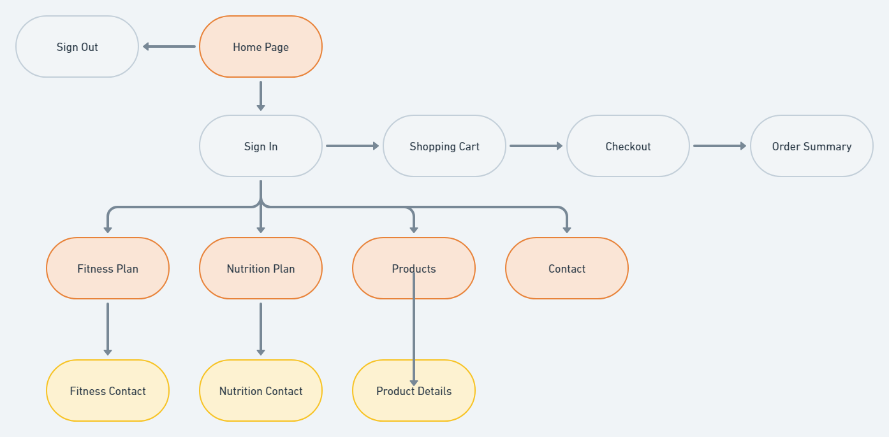
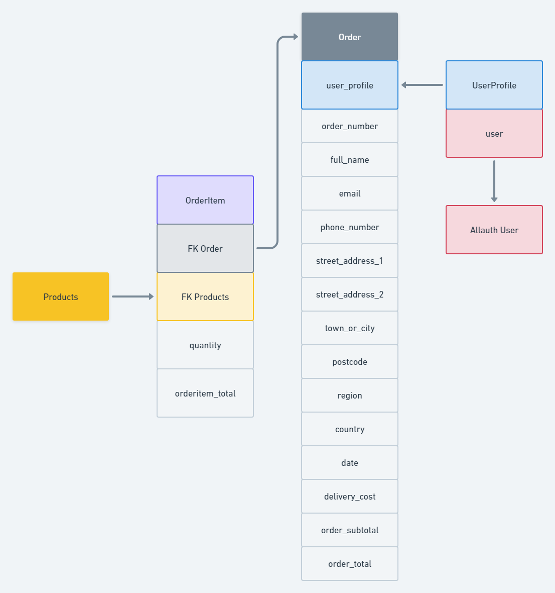

# Dog Fitness & Training

## Table of Contents

* [Description](#description)
* [User Stories](#user-stories)
* [Wireframe](#wireframe)
    * [Homepage](#homepage)
    * [Fitness Plan](#fitness-plan)
    * [Nutrition Plan](#nutrition-plan)
    * [Product Page](#product-page)
    * [Product Detail](#product-detail)
    * [Shopping Cart](#shopping-cart)
    * [Order Summary](#order-summary)
    * [Contact](#contact)
* [Structure](#structure)
    * [App Flow](#app-flow)
    * [Data Schema](#data-schema)
* [Models](#models)
* [Features](#features)
* [Colors Used](#colors-used)
* [Am I Responsive](#am-i-responsive)
* [Testing](#testing)
* [Validator Testing](#validator-testing)
* [Lighthouse Testing](#lighthouse-testing)
* [Bugs](#bugs)
* [Deployment](#deployment)
* [Credits](#credits)
* [Content](#content)

## Description

Dog Fitness & Nutrition is a website aimed at dog owners seeking to improve their dogs health. There are three main parts to the website: ***Fitness Plan***, ***Nutrition Plan*** and ***Products***

- ***Fitness Plan***

In the fitness plan section, the site user can view fitness advice for dogs, benefits to keeping their dog fit and the option to subscribe to a fitness plan which includes personal or group meetups with a professional instructor. The meetups consist of exercises that the dog owners can do with their dog ranging from basic exercises to advance agility training depending on the dogs physical abilities and needs.

- ***Nutrition Plan***

In the nutrition plan section, the site user can view nutritional advice for dogs, benefits to feeding their dog a healthy diet and the option to subscribe to a nutrition plan which includes a delivery of food and suppliments specific to the dogs needs and a plan for feeding times and quantity.

- ***Products***

In the products section, the site user can browse the online store and purchase fitness and nutrition supplies for dogs. The site user can browse by categories or view all products. The site user can select a product to view the product page which displays a description of the product, price, images, product rating, reviews as well as being able to add the product to the shopping cart. The site user can also rate and review individual products.

[Back to top](#table-of-contents)

## User Stories

### Viewing and Navigation
| ***As a*** | ***I want to be able to*** | ***so that I can*** |
| ---- | ---- | ---- |
| shopper | view a list of products | select something to purchase |
| shopper | individual product details | identify the description, price, images, product rating and reviews |
| shopper | easily view the total of my purchases at any time | avoid spending too much |

### Registration and User Accounts
| ***As a*** | ***I want to be able to*** | ***so that I can*** |
| ---- | ---- | ---- |
| site user | easily register for an account | have a personal account and be able to view my profile |
| site user | easily login or logout | access my personal account information |
| site user | easily recover my password in case I forget it | recover access to my account |
| site user | receive an email confirmation after registering | verify that my account registration was successful |
| site user | have a personalized user profile | view my personal order history and order confirmations, and save my payment information |

### Sorting and Searching
| ***As a*** | ***I want to be able to*** | ***so that I can*** |
| ---- | ---- | ---- |
| shopper | sort the list of available products | easily identify the best rated, best priced and categorically sorted products |
| shopper | sort a specific category of product | find the best-priced or best-rated product in a specific category, or sort the products in that category by name |
| shopper | sort multiple categories of products simultaneously | find the best-priced or best-rated products across broad categories, such as "Fitness", "Dry Food" or "Supplements" |
| shopper | search for a product by name or description | find a specific product I would like to purchase |
| shopper | easily see what I have searched for and the number of results | quickly decide whether the product I want is available |

### Purchasing and Checkout
| ***As a*** | ***I want to be able to*** | ***so that I can*** |
| ---- | ---- | ---- |
| shopper | easily select the size and quantity of a product when purchasing it | ensure I don't accidentally select the wrong product, quantity or size |
| shopper | view items in my bag to be purchased | identify the total cost of my purchase and all items I will receive |
| shopper | adjust the quantity of individual items in my bag | easily make changes to my purchase before checkout |
| shopper | easily enter my payment information | check out quickly and with no hassles |
| shopper | feel my personal and payment information is safe and secure | confidently provide the needed information to make a purchase |
| shopper | view an order confirmation after checkout | verify that I haven't made any mistakes |
| shopper | receive an email confirmation after checking out | keep the confirmation of what I have purchased for my records |

### Admin and Store Management
| ***As a*** | ***I want to be able to*** | ***so that I can*** |
| ---- | ---- | ---- |
| store owner | add a product | add new items to my store |
| store owner | edit/update a product | change product prices, descriptions, images and other product criteria |
| store owner | delete a product | remove items that are no longer for sale |

[Back to top](#table-of-contents)

## Wireframe

### Homepage

Desktop

Tablet

Mobile

[Back to top](#table-of-contents)

### Fitness Plan

Desktop

Tablet

Mobile

[Back to top](#table-of-contents)

### Nutrition Plan

Desktop

Tablet

Mobile

[Back to top](#table-of-contents)

### Product Page

Desktop

Tablet

Mobile

[Back to top](#table-of-contents)

### Product Detail

Desktop

Tablet

Mobile

[Back to top](#table-of-contents)

### Shopping Cart

#### Step 1

Desktop

Tablet

Mobile

#### Step 2

Desktop

Tablet

Mobile

[Back to top](#table-of-contents)

### Order Summary

Desktop

Tablet

Mobile

[Back to top](#table-of-contents)

### Contact

Desktop

Tablet

Mobile

[Back to top](#table-of-contents)

## Structure

### App Flow

Guest User

Authenticated User

Admin

[Back to top](#table-of-contents)

### Data Schema

Products

Orders

Contact

[Back to top](#table-of-contents)

## Models

### ProductCategory

| Name | Key | Type | Other Details |
| ---- | ---- | ---- | ---- |
| name | | CharField | max_length=254 |
| friendly_name | | CharField | max_length=254 |

### Products

| Name | Key | Type | Other Details |
| ---- | ---- | ---- | ---- |
| category | FK (ProductCategory) | | null=True, on_delete=models.SET_NULL |
| name | | CharField | max_length=254 |
| description | | TextField | |
| sizes | | BooleanField | default=False, null=True, blank=True |
| price | | DecimalField | max_digits=6, decimal_places=2 |
| rating | | DecimalField | max_digits=6, decimal_places=2, null=True, blank=True |
| image_url | | URLField | max_length=1024, null=True, blank=True |
| image | | ImageField | null=True, blank=True |

### Order

| Name | Key | Type | Other Details |
| ---- | ---- | ---- | ---- |
| user_profile | FK (UserProfile) | | null=True, related_name='orders', on_delete=models.SET_NULL |
| order_number | | CharField | max_length=32, null=False, editable=False |
| full_name | | CharField | max_length=50, null=False, blank=False |
| email | | EmailField | max_length=254, null=False, blank=False |
| phone_number | | CharField | max_length=20, null=False, blank=False |
| country | | CharField | max_length=40, null=False, blank=False |
| postcode | | CharField | max_length=20, null=False, blank=False |
| town_or_city | | CharField | max_length=20, null=False, blank=False |
| street_address1 | | CharField | max_length=80, null=False, blank=False |
| street_address2 | | CharField | max_length=80, null=True, blank=True |
| region | | CharField | max_length=80, null=True, blank=True |
| date | | DateTimeField | auto_now_add=True |
| delivery_cost | | DecimalField | max_digits=6, decimal_places=2, null=False, default=0 |
| order_subtotal | | DecimalField | max_digits=10, decimal_places=2, null=False, default=0 |
| order_total | | DecimalField | max_length=10, decimal_places=2, null=False, default=0 |

### Contact Form

| Name | Key | Type | Other Details |
| ---- | ---- | ---- | ---- |
| name |  | CharField | max_length=50 null=False, blank=False |
| email |  | EmailField | max_length=254 null=False, blank=False |
| message |  | CharField | max_length=2000 null=False, blank=False |

### Fitness Plan

| Name | Key | Type | Other Details |
| ---- | ---- | ---- | ---- |
| your_name |  | CharField | max_length=50 null=False, blank=False |
| dogs_name |  | CharField | max_length=50 null=False, blank=False |
| dogs_age |  | CharField | max_length=50 null=False, blank=False |
| dogs_breed |  | CharField | max_length=50 null=False, blank=False |
| sessions |  | ChoiceField | default=False, null=False, blank=False |
| email |  | EmailField | max_length=254 null=False, blank=False |
| message |  | CharField | max_length=2000 null=False, blank=False |

### Nutrition Plan

| Name | Key | Type | Other Details |
| ---- | ---- | ---- | ---- |
| your_name |  | CharField | max_length=50 null=False, blank=False |
| dogs_name |  | CharField | max_length=50 null=False, blank=False |
| dogs_breed |  | CharField | max_length=50 null=False, blank=False |
| dogs_age |  | CharField | max_length=50 null=False, blank=False |
| dogs_gender |  | ChoiceField | default=False, null=False, blank=False |
| dogs_weight |  | CharField | max_length=50 null=False, blank=False |
| dogs_physique |  | ChoiceField | default=False, null=False, blank=False |
| active_level |  | ChoiceField | default=False, null=False, blank=False |
| eating_habit |  | ChoiceField | default=False, null=False, blank=False |
| does_not_eat |  | CharField | max_length=50 null=True, blank=True |
| allergies |  | CharField | max_length=50 null=True, blank=True |
| food_preference |  | ChoiceField | default=False, null=False, blank=False |
| outcome_goal |  | ChoiceField | default=False, null=False, blank=False |
| email |  | EmailField | max_length=254 null=False, blank=False |
| message |  | CharField | max_length=2000 null=False, blank=False |

[Back to top](#table-of-contents)

## Features

* ***Brand*** image for website
    

    
Image

    
    

---

* ***Homepage*** where the site user can read about the company and navigate to different areas of the website
    

    
Image

    
    

---

* ***Fitness plan*** page where the site user can read about the benefits of keeping their dog fit

* Option to ***subscribe*** to a ***fitness plan***
    

    
Image

    
    

---

* ***Nutrition plan*** page where the site user can read about the benefits of feeding their dog a healthy diet

* Option to ***subscribe*** to a ***nutrition plan***
    

    
Image

    
    

---

* ***Product page*** where the site user can browse the online store

* Option to ***make purchases*** from the store
    

    
Image

    
    

---

* ***Product detail*** page where the site user can view details on a specific product

* Option to view and leave ***ratings and reviews***
    

    
Image

    
    

---

* ***Shopping cart*** page where the site user can view the products that they have put in the cart

* Option to proceed to ***checkout*** to complete product purchases
    

    
Image

    
    

---

* ***Checkout page*** where the site user can enter their details and complete their purchase
    

    
Image

    
    

---

* ***Contact page*** where the site user can find contact information of the company
    

    
Image

    
    

* Option to ***send a message*** directly from the contact page

---

[Back to top](#table-of-contents)

## Colors Used

| #000958 | #FDE7CB | #F2F2F2 | #FFFAF5 | #FFFFFF |
| ---- | ---- | ---- | ---- | ---- |
|  |  |  |  |  |

[Back to top](#table-of-contents)

## Testing

## Validator Testing

### CSS

| File Name | File Path | Result | Error/Warning | Comment |
| ----- | ----- | ----- | ----- | ----- |
| base.css | /base.css |  | 7 warnings -  [link](docs/basecss.png) |
| home.css | home/home.css |  |  |
| profile.css | profiles/profile.css |  |  |
| fitness_plans.css | fitness_plans/fitness_plans.css |  |  |
| nutrition_plans.css | nutrition_plans/nutrition_plans.css |  |  |
| contact.css | contact/contact.css |  | 3 warnings -  [link](docs/contactcss.png) |
| checkout.css | checkout/checkout.css |  | 1 warning -  [link](docs/checkoutcss.png) |

### JS

| File Name | File Path | JSHint | Comment |
| ----- | ----- | ----- | ----- |
| countryfield.js | profiles/countryfield.js | [link](docs/countryfieldjstest.png) |
| stripe_elements.js | checkout/stripe_elements.js | [link](docs/stripeelementsjstest.png) |

[Back to top](#table-of-contents)

## Lighthouse Testing

| Page Name | Desktop/Mobile | Comment |
| ----- | ----- | -----|
| Home | [link](docs/lighthousehomedesk.png) / [link](docs/lighthousehomemob.png) |
| Fitness Plan | [link](docs/lighthousefitnessdesk.png) / [link](docs/lighthousefitnessmob.png) |
| Nutrition Plan | [link](docs/lighthousenutritiondesk.png) / [link](docs/lighthousenutritionmob.png) |
| Products | [link](docs/lighthouseproductdesk.png) / [link](docs/lighthouseproductmob.png) |
| Products Detail | [link](docs/lighthousedetailsdesk.png) / [link](docs/lighthousedetailsmob.png) |
| Shopping Cart | [link](docs/lighthousebagdesk.png) / [link](docs/lighthousebagmob.png) |
| Order Summary | [link](docs/lighthousecheckoutdesk.png) / [link](docs/lighthousecheckoutmob.png) |
| Contact | [link](docs/lighthousecontactdesk.png) / [link](docs/lighthousecontactmob.png) |

[Back to top](#table-of-contents)

## Bugs

| Issue | Comment |
| ----- | ----- |
|  |  |

## Fixed Bugs

| Issue | Commit | File Name | Line | Comment |
| ----- | ----- | ----- | ----- | ----- |
|  |  |  |  |

[Back to top](#table-of-contents)

## Deployment
This project was deployed using Heroku
* Steps for deployment
  * Create a Heroku app
  * Change `DEBUG` in ***settings.py*** to `False`
  * Link the Heroku app to the repository
  * Click on deploy

The live link can be found here - https://dog-fitness-and-nutrition.herokuapp.com/

[Back to top](#table-of-contents)

## Credits

* Simen Daehlin (Mentor)
* Code Institude
    * This project was largely based off the Boutique Ado project

[Back to top](#table-of-contents)

## Content

* Images sourced from https://unsplash.com/
* Wireframe created on https://app.uizard.io/
* Fonts sourced from https://fonts.google.com/

[Back to top](#table-of-contents)